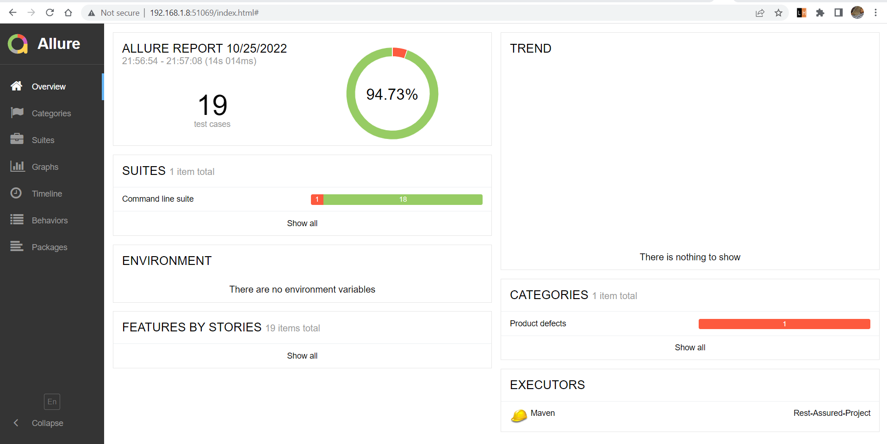
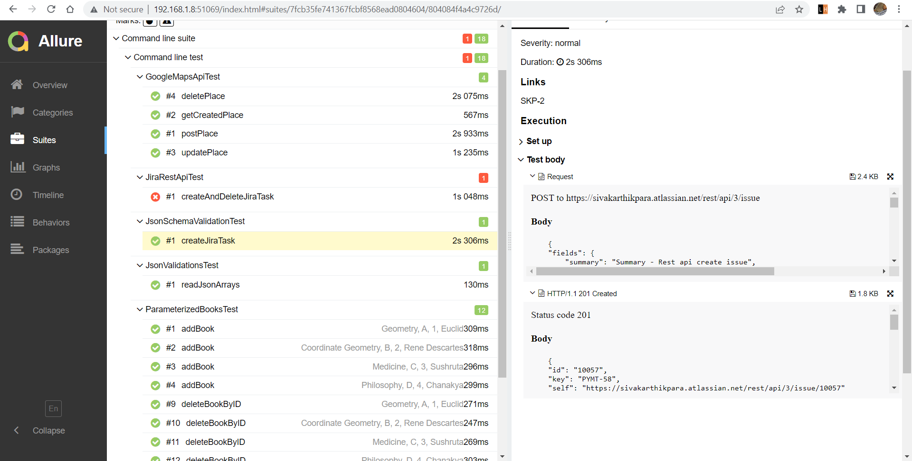

# Rest-Assured-Project
### This Project is based on RestAssured and TestNG

REST Assured is a Java DSL for simplifying testing of REST based services built on top of HTTP Builder. It supports POST, GET, PUT, DELETE, OPTIONS, PATCH and HEAD requests and can be used to validate and verify the response of these requests. All Rest-Assured calls generate attachments for report: Request, Response, Swagger validation results.

#### Allure Report on local

</img>

</img>

#### Jenkins reports

#### Allure report on jenkins

